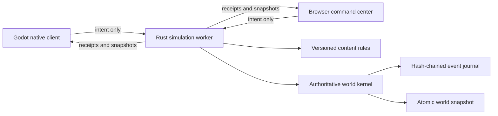

# P0.2 implementation guide

**Status:** Playable local vertical slice

## What this milestone proves

P0.2 connects a first-person Godot client and a browser command center to one Rust authoritative simulation. A player begins beside a powered salvage skiff, follows a five-stage industrial contract, mines a deterministic asteroid, manufactures and moves resources, extends the grid, anchors it to voxels, moves it when released, and splits it through damage. Accepted work grants authoritative career experience. The server persists each accepted event before acknowledging it and reconstructs the same world after restart.



## Authority and conservation

Clients choose targets and request actions; they never choose yields, damage, health, power, production outputs, or final transforms. The simulation checks distance, adjacency, inventory, power, motion budgets, and anchor contact. A conservation proof runs after every accepted event. If ore, refined material, components, installed blocks, or destroyed blocks do not reconcile, the event is rejected.

The content manifest `p0.1.0` defines voxel yields, recipes, block health, component costs, and power behavior. Its version is stored in the universe manifest and snapshots and included in every canonical event hash. Opening a universe under a different rule version fails explicitly.

The save schema is version 2 and the client protocol is version 2. These versions add the career aggregate and derived level fields. A version mismatch fails explicitly; the runtime never guesses how to reinterpret an older save.

## Local operation

On macOS, run:

```bash
tools/dev/bootstrap-macos.sh
tools/dev/run-local.sh
```

The persistent local world is stored under the ignored `data/local-universe` directory. To start a fresh world without deleting the old one, run `tools/dev/reset-local-world.sh`; it moves the existing world into an ignored backup directory.

The headless service can run independently on macOS or Linux:

```bash
tools/dev/run-server.sh
```

Its local interfaces are:

| Interface | Address | Purpose |
| --- | --- | --- |
| Browser UI | `http://127.0.0.1:7777/` | Spectate and issue production/grid commands |
| Status | `http://127.0.0.1:7777/api/v1/status` | Health, authority, hash, and conservation |
| World read | `http://127.0.0.1:7777/api/v1/world` | Complete public P0 snapshot |
| WebSocket | `ws://127.0.0.1:7777/ws` | Versioned client protocol |

## Verification

`tools/ci/check.sh` runs formatting, unit/property/fault tests, static analysis, browser parsing, documentation linting, Godot project validation, and the complete cross-process scenario.

The scenario proves:

1. Authoritative mining, refining, crafting, transfer, building, anchoring, motion, damage, split, experience, and contract progression.
2. Conservation after every mutation.
3. Exact world-hash recovery after graceful restart.
4. A higher writer-fencing token after authority changes.
5. Godot WebSocket connection and snapshot rendering against the recovered server.

## Deliberate limits

This slice has one local player, one small asteroid, one 25-block salvage skiff, and one five-stage contract. Grid motion is deterministic kinematic integration, not collision physics. It sends complete JSON snapshots and is not intended for production bandwidth. Its distant planet is visual context, not a landable voxel body. It has no accounts, safe zones, offline cleanup, multiplayer partitioning, real markets, token custody, or smart contracts. These are roadmap work, not implied capabilities of P0.2.

## Migration and rollback

P0.2 has no deployed predecessor to migrate. It rejects save schema 1 because the player career aggregate did not exist there. A universe also records content manifest `p0.1.0` and refuses to open under another rule set. Local testers can use `tools/dev/reset-local-world.sh` to move an incompatible world into a recoverable backup before creating a new one.

Rollback is operational only: stop the worker, preserve its data directory, and return to the prior repository revision. No P0.2 action reaches a blockchain or changes external custody. A future content migration must be explicit, versioned, tested against a copy, and documented before the runtime will accept it.
