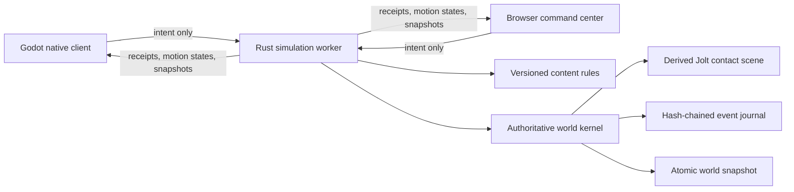

# P0.9 implementation guide

**Status:** Playable local vertical slice; authoritative EVA implemented and verified on macOS, Ubuntu evidence pending

## What this milestone proves

P0.9 connects a first-person Godot client and a browser command center to one Rust authoritative simulation. A player begins in vacuum beside a powered 25-block salvage skiff and an independent orbital asteroid more than three kilometers from Khepri Prime's modeled surface. The player uses input-only six-axis EVA and roll, manages physical inventory through a compact connected-inventory terminal, controls the helmet seal and oxygen reserve, then mines, manufactures, places oriented frames, welds them through persistent integrity stages, and operates or destroys the resulting grid. One server-owned Jolt scene integrates the character and grids against the spherical planet, voxel chunks, and block compounds. Authoritative oxygen failure incapacitates the player, atomically moves carried inventory into a canonical drop, blocks further work, and permits only a free server-selected proof recovery. The server persists received control transitions and quantized physics outcomes before publishing them and reconstructs the same world after restart.



## Authority and conservation

Clients choose targets and request actions; they never choose yields, damage, health, power, production outputs, oxygen outcomes, capacity, grid or character transforms, velocities, contacts, or elapsed simulation time. Character clients submit only bounded translation and angular controls under a server-owned movement epoch. A durable receipt advances the received sequence, while the persisted FIFO consumes at most one transition per 60 Hz substep and advances the processed sequence exposed for prediction reconciliation. The server owns Jolt-backed EVA, gravity, rotation, collision, and landing contact in the same atomic physics event as the grids. Walking, jump, grounded locomotion, and moving-platform attachment remain P0.10-or-later work. A conservation proof runs after every accepted event. If ore, refined material, components, installed blocks, or destroyed blocks do not reconcile, the event is rejected.

The content manifest `p0.9.0` and content schema 7 identify the current contact-physics, survival, and character-motion rule set. Voxel yields, recipes, block health, component costs, construction integrity, power behavior, inventory capacity, resource volume and mass, exact integer block mass, collision chunk edge, grid control force and torque, character mass and collision radius, EVA acceleration and speed limits, dampening, control-lease length, friction, restitution, environment constants, oxygen rates, critical threshold, and proof recovery defaults are server owned. The manifest version is stored in universe manifests and snapshots and included in every canonical event hash. Opening a universe under a different rule version fails explicitly.

The save schema is version 12, the canonical event schema is version 7, and the client protocol is version 9. In addition to construction, grid physics, survival, and death-drop state, they include canonical character orientation and velocity, received and processed input-sequence frontiers, a bounded persisted control FIFO, the active control lease, optional atomic player physics outcomes, and lightweight motion replication. A receipt proves durable acceptance, not fixed-step consumption; `last_processed_input_sequence` advances only when the control is retired or applied by the authoritative step. A client receives no world state and can submit no intent until a compatible `hello`; mismatch is fatal and closes the socket. Save and event headers are checked before version-specific payloads are deserialized, so older formats fail explicitly instead of being guessed.

## Local operation

On macOS, run:

```bash
tools/dev/bootstrap-macos.sh
tools/dev/run-local.sh
```

The persistent local world is stored under the ignored `data/local-universe` directory. To start a fresh world without deleting the old one, run `tools/dev/reset-local-world.sh`; it moves the existing world into an ignored backup directory.

The headless service can run independently on macOS or Linux:

```bash
tools/dev/run-server.sh
```

Its local interfaces are:

| Interface | Address | Purpose |
| --- | --- | --- |
| Browser UI | `http://127.0.0.1:7777/` | Spectate and issue production/grid commands |
| Status | `http://127.0.0.1:7777/api/v1/status` | Health, authority, hash, and conservation |
| World read | `http://127.0.0.1:7777/api/v1/world` | Complete public P0 snapshot |
| WebSocket | `ws://127.0.0.1:7777/ws` | Versioned client protocol |

## Verification

`tools/ci/check.sh` runs formatting, unit/property/fault tests, static analysis, browser parsing, documentation linting, Godot project validation, and the complete cross-process scenario.

The scenario proves:

1. Input-only authoritative EVA and tapped roll, environment, suit mode, oxygen failure, death-drop conservation, proof respawn, inventory capacity, mining, refining, crafting, transfer, sealed unfinished cargo, durable construction completion, repair, anchoring, force/torque motion, character/grid/voxel collision, tool damage, tool-driven split, experience, and contract progression.
2. Conservation after every mutation.
3. Exact world-hash recovery after graceful restart.
4. A higher writer-fencing token after authority changes.
5. Godot WebSocket connection, separate received/processed control acknowledgement, lightweight motion reconciliation, and snapshot rendering against the recovered server.
6. Deterministic native impairment coverage for delayed or skipped motion states, correction smoothing and snaps, menu-open gravity, lifecycle gating, bounded prediction history, and motion-only updates without structural rebuilds.

## Deliberate limits

This slice has one local player, one orbital asteroid, one 25-block salvage skiff, one bounded spherical planet/contact proof, and one five-stage contract. Individual block placement orientation is limited to four local yaw rotations, while grid bodies and the EVA character have full three-axis orientation. Native Jolt manifolds replace geometric fallback telemetry, but the public callback exposes only a pre-solver pairwise impulse estimate, not the applied solver impulse required for production collision damage. Khepri is not yet a globally streamed editable voxel planet or practical multi-kilometer travel destination. The P0.9 sphere controller does not provide walking, jump, grounded locomotion, slopes, stairs, ladders, magnetic boots, or moving-platform attachment. The death drop has no recovery, permission, or expiry scheduler yet, and the proof recovery point is neither a powered spawn facility nor the capital. Complete JSON snapshots and local lightweight motion broadcasts are not production multiplayer replication. Accounts, safe zones, offline cleanup, multiplayer partitioning, pressurized-room graphs, real markets, token custody, and smart contracts remain roadmap work, not implied capabilities of P0.9.

## Migration and rollback

P0.9 has no deployed predecessor to migrate. It rejects save schemas 1 through 11 and event schemas before 7 because their player, inventory, environment, block, physics, life-state, or queued-control contracts differ. A universe records content manifest `p0.9.0` and refuses to open under another rule set, including `p0.8.0` worlds without canonical character physics. Protocols before 9 are rejected at the handshake. Local testers can use `tools/dev/reset-local-world.sh` to move an incompatible world into a recoverable backup before creating a new one.

Rollback is operational only: stop the worker, preserve its data directory, and return to the prior repository revision. No P0.9 action reaches a blockchain or changes external custody. A future content migration must be explicit, versioned, tested against a copy, and documented before the runtime will accept it.
