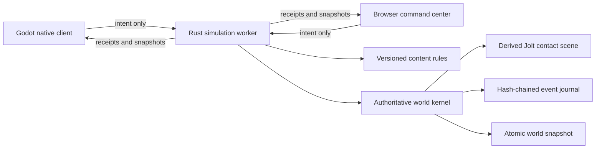

# P0.7 implementation guide

**Status:** Playable local vertical slice; contact-physics integration in validation

## What this milestone proves

P0.7 connects a first-person Godot client and a browser command center to one Rust authoritative simulation. A player begins in vacuum beside a powered salvage skiff and an independent orbital asteroid more than three kilometers from Khepri Prime's modeled surface. The player uses six-axis EVA roll, manages physical inventory through a compact connected-inventory terminal, controls the helmet seal and oxygen reserve, then mines, manufactures, places oriented frames, welds them through persistent integrity stages, and operates or destroys the resulting grid. A server-owned Jolt scene integrates force and torque controls against compound grid and voxel bodies. The server persists accepted inputs and quantized physics outcomes before publishing them and reconstructs the same world after restart without rerunning earlier collisions.



## Authority and conservation

Clients choose targets and request actions; they never choose yields, damage, health, power, production outputs, oxygen outcomes, capacity, grid velocity, grid contacts, or grid transforms. The P0 character client still proposes bounded absolute positions, which the server sweeps against voxel and grid volumes and checks against the planet surface. Input-only authoritative character motion remains later closure work. A conservation proof runs after every accepted event. If ore, refined material, components, installed blocks, or destroyed blocks do not reconcile, the event is rejected.

The content manifest `p0.7.2` identifies the contact-physics rule set. Voxel yields, recipes, block health, component costs, construction integrity, power behavior, inventory capacity, resource volume and mass, exact integer block mass, control force, torque, dampening, friction, restitution, and environment constants are server owned. The manifest version is stored in universe manifests and snapshots and included in every canonical event hash. Opening a universe under a different rule version fails explicitly.

The save schema is version 9, the canonical event schema is version 4, and the client protocol is version 6. They include explicit construction completion, full grid quaternions, three-axis angular velocity, force/torque controls, exact physical mass inputs, native manifold telemetry, persisted contact lifecycle, and committed body/contact outcomes. A client receives no world state and can submit no intent until a compatible `hello`; mismatch is fatal and closes the socket. Save and event headers are checked before version-specific payloads are deserialized, so older formats fail explicitly instead of being guessed.

## Local operation

On macOS, run:

```bash
tools/dev/bootstrap-macos.sh
tools/dev/run-local.sh
```

The persistent local world is stored under the ignored `data/local-universe` directory. To start a fresh world without deleting the old one, run `tools/dev/reset-local-world.sh`; it moves the existing world into an ignored backup directory.

The headless service can run independently on macOS or Linux:

```bash
tools/dev/run-server.sh
```

Its local interfaces are:

| Interface | Address | Purpose |
| --- | --- | --- |
| Browser UI | `http://127.0.0.1:7777/` | Spectate and issue production/grid commands |
| Status | `http://127.0.0.1:7777/api/v1/status` | Health, authority, hash, and conservation |
| World read | `http://127.0.0.1:7777/api/v1/world` | Complete public P0 snapshot |
| WebSocket | `ws://127.0.0.1:7777/ws` | Versioned client protocol |

## Verification

`tools/ci/check.sh` runs formatting, unit/property/fault tests, static analysis, browser parsing, documentation linting, Godot project validation, and the complete cross-process scenario.

The scenario proves:

1. Authoritative environment, suit mode, inventory capacity, mining, refining, crafting, transfer, sealed unfinished cargo, durable construction completion, repair, anchoring, force/torque motion, grid–voxel collision, tool damage, tool-driven split, experience, and contract progression.
2. Conservation after every mutation.
3. Exact world-hash recovery after graceful restart.
4. A higher writer-fencing token after authority changes.
5. Godot WebSocket connection and snapshot rendering against the recovered server.

## Deliberate limits

This slice has one local player, one orbital asteroid, one 25-block salvage skiff, one distant planet representation, and one five-stage contract. Individual block placement orientation is limited to four local yaw rotations, while grid bodies have full three-axis orientation. Native Jolt manifolds now replace geometric fallback telemetry, but the public callback exposes only a pre-solver pairwise impulse estimate, not the applied solver impulse required for production collision damage. The planet is a gravity, atmosphere, and rendering proof, not a globally streamed editable voxel sphere or current landing destination. Complete JSON snapshots are not intended for production bandwidth. Accounts, safe zones, offline cleanup, multiplayer partitioning, pressurized-room graphs, real markets, token custody, and smart contracts remain roadmap work, not implied capabilities of P0.7.

## Migration and rollback

P0.7 has no deployed predecessor to migrate. It rejects save schemas 1 through 8 because their player, inventory, environment, block, or physics contracts differ. A universe also records content manifest `p0.7.2` and refuses to open under another rule set. Local testers can use `tools/dev/reset-local-world.sh` to move an incompatible world into a recoverable backup before creating a new one.

Rollback is operational only: stop the worker, preserve its data directory, and return to the prior repository revision. No P0.7 action reaches a blockchain or changes external custody. A future content migration must be explicit, versioned, tested against a copy, and documented before the runtime will accept it.
