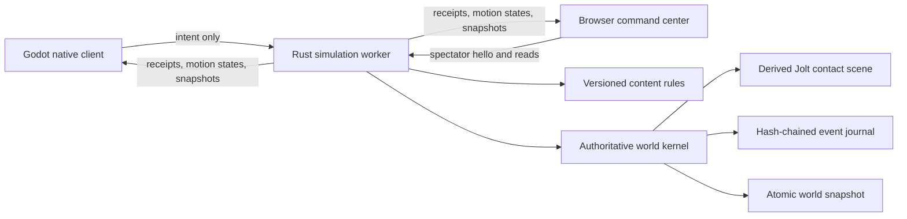

# P0.10 implementation guide

**Status:** Playable simulation proof verified on macOS and hosted Ubuntu

## What this milestone proves

P0.10 connects a first-person Godot client and a browser command center to one Rust authoritative simulation. A player begins in vacuum beside a powered 25-block salvage skiff and an independent orbital asteroid more than three kilometers from Khepri Prime's modeled surface. The player uses input-only six-axis EVA, radial ground movement, jump, and magnetic boots; manages physical inventory through a connected-inventory terminal; controls the helmet seal and oxygen reserve; then mines, manufactures, places oriented frames, welds them through persistent integrity stages, and operates or destroys the resulting grid. One server-owned Jolt scene integrates the capsule and grids against the spherical planet, voxel chunks, and block compounds. Authoritative oxygen failure incapacitates the player, atomically moves carried inventory into a canonical drop, blocks further work, and permits only a free server-selected proof recovery. The server persists received controls and quantized physics outcomes before publishing them and reconstructs the same world after restart.



## Authority and conservation

Clients choose targets and request actions; they never choose yields, damage, health, power, production outputs, oxygen outcomes, capacity, grid or character transforms, velocities, contacts, support, or elapsed simulation time. Character clients submit only bounded translation, angular, jump, and suit-mode controls under a server-owned movement epoch. A durable receipt advances the received sequence, while the persisted FIFO consumes at most one transition per 60 Hz substep and advances the processed sequence exposed for prediction reconciliation. The server owns Jolt-backed EVA, gravity, rotation, collision, capsule walking, jump, radial upright alignment, and moving or magnetic support in the same atomic physics event as the grids. A conservation proof runs after every accepted event. If ore, refined material, components, installed blocks, or destroyed blocks do not reconcile, the event is rejected.

The P0.10 evidence used manifest `p0.10.0` and content schema 8. The active P1.1 branch uses manifest `p1.1.0` and content schema 9 to add actor-safe, non-repeatable career rewards without changing client authority. Voxel yields, recipes, block health, component costs, construction integrity, power behavior, inventory capacity, resource volume and mass, exact integer block mass, collision chunk edge, grid controls, capsule motion, environment, survival, proof recovery, and reward values are server owned. The manifest version is stored in universe manifests and snapshots and included in every canonical event hash. Opening a universe under a different rule version fails explicitly.

The verified P0.10 save schema is version 13 and its canonical event schema is version 8. P1.0 introduced world 14, event 10, and protocol 11 for the ordered roster, actor lifecycle, session binding, and atomic multi-player outcomes. P1.1 intentionally advances to world schema 15, event schema 11, and protocol 12. World 15 gives every grid a player owner, retains ownership on cargo drops and splits, and persists one-time anchor eligibility. Event 11 identifies the inventory consumed by construction and whether anchoring consumed its reward. Protocol 12 exposes the owner in public grid snapshots. These are reset boundaries: older saves, journals, manifests, and clients fail explicitly rather than guessing ownership or changing historical rewards. A receipt proves durable acceptance, not fixed-step consumption; `last_processed_input_sequence` advances only when control is retired or applied by the authoritative step. Save and event headers are checked before version-specific payloads are deserialized.

## Local operation

On macOS, run:

```bash
tools/dev/bootstrap-macos.sh
tools/dev/run-local.sh
```

The persistent local world is stored under the ignored `data/local-universe` directory. To start a fresh world without deleting the old one, run `tools/dev/reset-local-world.sh`; it moves the existing world into an ignored backup directory.

The headless service can run independently on macOS or Linux:

```bash
tools/dev/run-server.sh
```

Its local interfaces are:

| Interface | Address | Purpose |
| --- | --- | --- |
| Browser UI | `http://127.0.0.1:7777/` | Read-only public cell spectating |
| Status | `http://127.0.0.1:7777/api/v1/status` | Health, authority, hash, and conservation |
| World read | `http://127.0.0.1:7777/api/v1/world` | Complete public P0 snapshot |
| WebSocket | `ws://127.0.0.1:7777/ws` | Versioned client protocol |

## Verification

`tools/ci/check.sh` runs formatting, unit/property/fault tests, static analysis, browser parsing, documentation linting, Godot project validation, and the complete cross-process scenario.

The scenario proves:

1. Input-only authoritative EVA and tapped roll, environment, suit mode, oxygen failure, death-drop conservation, proof respawn, inventory capacity, mining, refining, crafting, transfer, sealed unfinished cargo, durable construction completion, repair, anchoring, force/torque motion, character/grid/voxel collision, tool damage, tool-driven split, experience, and contract progression.
2. Conservation after every mutation.
3. Exact world-hash recovery after graceful restart.
4. A higher writer-fencing token after authority changes.
5. Godot WebSocket connection, separate received/processed control acknowledgement, lightweight motion reconciliation, and snapshot rendering against the recovered server.
6. Deterministic native impairment coverage for delayed or skipped motion states, correction smoothing and snaps, menu-open gravity, lifecycle gating, bounded prediction history, and motion-only updates without structural rebuilds.
7. Capsule walking, sprint, braking, jump, slopes, bounded steps, ground snap, six-axis radial upright alignment, pole traversal, moving/rotating supports, magnetic eligibility, deterministic detach, and grid-split rebinding.
8. Portable Apple Silicon and Linux archives whose exported clients connect to their bundled authoritative servers and pass the native smoke scenario.

## Deliberate limits

This slice pre-admits two playable loopback development actors, advances both in one ordered physics event, and supports native binding/presentation for either identity. Actor-owned character control, mining, production, transfer, construction, grid operation, career progress, suit lifecycle, and idempotency are converted. The starter grid belongs to the local actor; the remote actor has a suit inventory but no grid, so constructive and control attempts against the starter fail closed while valid non-owner damage remains possible. Refining and crafting remain immediate inventory recipe proofs without machinery, power, time, or queues. Grid control is owner-authorized remotely without cockpit possession. The death drop has no recovery, permission, or expiry scheduler yet. Complete JSON snapshots and local motion broadcasts remain a correctness transport and do not provide private inventory projection or production multiplayer scaling. Accounts, safe zones, cleanup, partitioning, pressurized-room graphs, markets, token custody, and smart contracts remain roadmap work.

## Migration and rollback

P0.10 has no deployed predecessor to migrate. P1.1 requires world schema 15, event schema 11, content schema 9, manifest `p1.1.0`, and protocol 12. It does not silently coerce a schema-14 P1.0 world, event-10 journal, `p0.10.0` universe, or protocol-11 client because none records the complete owner and reward contract. Local testers can use `tools/dev/reset-local-world.sh` to move an incompatible world into a recoverable backup before creating a fresh P1.1 universe.

Rollback is operational only: stop the worker, preserve its data directory, and return to the prior repository revision. No P0.10 action reaches a blockchain or changes external custody. A future content migration must be explicit, versioned, tested against a copy, and documented before the runtime will accept it.
