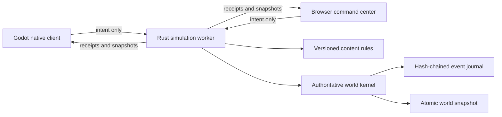

# P0.5 implementation guide

**Status:** Playable local vertical slice

## What this milestone proves

P0.5 connects a first-person Godot client and a browser command center to one Rust authoritative simulation. A player begins in Khepri Prime's atmosphere beside a powered salvage skiff and mineable outcrop, manages physical inventory through a two-sided logistics terminal, experiences local gravity with the jetpack offline, controls the helmet seal and oxygen reserve, then mines, manufactures, places oriented frames, welds them through persistent integrity stages, and operates or destroys the resulting grid. The server persists each accepted event before acknowledging it and reconstructs the same world after restart.



## Authority and conservation

Clients choose targets and request actions; they never choose yields, damage, health, power, production outputs, oxygen outcomes, capacity, or final transforms. The simulation checks distance, adjacency, inventory volume, power, planetary surface penetration, motion budgets, and anchor contact. A conservation proof runs after every accepted event. If ore, refined material, components, installed blocks, or destroyed blocks do not reconcile, the event is rejected.

The content manifest `p0.5.0` identifies the planetary-logistics rule set. Voxel yields, recipes, block health, component costs, construction integrity, power behavior, inventory capacity, resource volume and mass, and environment constants are server owned. The manifest version is stored in universe manifests and snapshots and included in every canonical event hash. Opening a universe under a different rule version fails explicitly.

The save schema is version 5 and the client protocol is version 4. Save version 5 adds inventory capacity plus persistent suit oxygen, helmet, and jetpack state. Protocol version 4 adds physical inventory metrics, the local environment snapshot, suit state, and the suit-mode intent. A version mismatch fails explicitly; the runtime never guesses how to reinterpret an older save.

## Local operation

On macOS, run:

```bash
tools/dev/bootstrap-macos.sh
tools/dev/run-local.sh
```

The persistent local world is stored under the ignored `data/local-universe` directory. To start a fresh world without deleting the old one, run `tools/dev/reset-local-world.sh`; it moves the existing world into an ignored backup directory.

The headless service can run independently on macOS or Linux:

```bash
tools/dev/run-server.sh
```

Its local interfaces are:

| Interface | Address | Purpose |
| --- | --- | --- |
| Browser UI | `http://127.0.0.1:7777/` | Spectate and issue production/grid commands |
| Status | `http://127.0.0.1:7777/api/v1/status` | Health, authority, hash, and conservation |
| World read | `http://127.0.0.1:7777/api/v1/world` | Complete public P0 snapshot |
| WebSocket | `ws://127.0.0.1:7777/ws` | Versioned client protocol |

## Verification

`tools/ci/check.sh` runs formatting, unit/property/fault tests, static analysis, browser parsing, documentation linting, Godot project validation, and the complete cross-process scenario.

The scenario proves:

1. Authoritative environment, suit mode, inventory capacity, mining, refining, crafting, transfer, building, anchoring, motion, damage, split, experience, and contract progression.
2. Conservation after every mutation.
3. Exact world-hash recovery after graceful restart.
4. A higher writer-fencing token after authority changes.
5. Godot WebSocket connection and snapshot rendering against the recovered server.

## Deliberate limits

This slice has one local player, one mineable outcrop, one 25-block salvage skiff, one bounded planetary surface region, and one five-stage contract. Orientation is limited to four yaw rotations, and one registered component is consumed entirely when its frame is placed. Grid motion is deterministic kinematic integration, not rigid-body collision physics. The planet surface is a gravity/atmosphere and rendering proof, not a globally streamed editable voxel sphere. Decorative ridges and boulders are not canonical mining targets. Complete JSON snapshots are not intended for production bandwidth. Accounts, safe zones, offline cleanup, multiplayer partitioning, pressurized-room graphs, real markets, token custody, and smart contracts remain roadmap work, not implied capabilities of P0.5.

## Migration and rollback

P0.5 has no deployed predecessor to migrate. It rejects save schemas 1 through 4 because their player, inventory, environment, or block contracts differ. A universe also records content manifest `p0.5.0` and refuses to open under another rule set. Local testers can use `tools/dev/reset-local-world.sh` to move an incompatible world into a recoverable backup before creating a new one.

Rollback is operational only: stop the worker, preserve its data directory, and return to the prior repository revision. No P0.5 action reaches a blockchain or changes external custody. A future content migration must be explicit, versioned, tested against a copy, and documented before the runtime will accept it.
