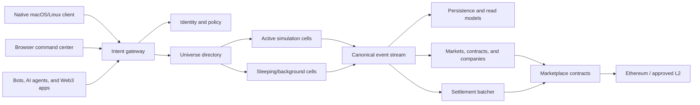

# System architecture

**Status:** Proposed baseline

## Architectural goals

- Present one persistent universe to thousands of concurrent participants.
- Preserve authoritative physics and economic conservation.
- Permit a practically unbounded generated frontier.
- Keep routine gameplay independent of blockchain latency.
- Make lifecycle history publicly verifiable.
- Support humans, bots, NPCs, AI agents, browser applications, and native clients.
- Keep official and private-server economies cryptographically and operationally isolated.
- Permit individual services and simulation cells to fail without corrupting canonical ownership.

## Context

## Authority hierarchy

1. **Smart contracts** own deposited BIT, tokenized market receipts, settlement commitments, and on-chain governance authority.
2. **Canonical universe services** own identity links, asset ownership, organizations, contracts, and cross-cell transfer state.
3. **Simulation cells** own active voxel, physics, machine, damage, and local inventory state.
4. **Clients and external applications** own presentation and submit authenticated intents.
5. **Private servers** own a separate namespace with no canonical asset authority.

No lower layer may unilaterally create state owned by a higher layer.

## Proposed components

### Edge and identity

- API gateway.
- Passkey/WebAuthn service.
- Smart-account association and recovery coordinator.
- Session-key and authorization service.
- Rate limiting and abuse controls.
- Public read-only API cache.

### Universe control plane

- Celestial and sector registry.
- Dynamic cell scheduler.
- Cell lease and fencing service.
- Player/grid transfer coordinator.
- Route and autopilot service.
- Content-manifest registry.
- Configuration and feature-policy service.

### Simulation plane

- Headless authoritative workers.
- Voxel chunk service.
- Grid/physics kernel.
- Power, conveyor, inventory, production, damage, combat, and AI systems.
- Interest management and client replication.
- Snapshot writer and event journal.
- Offline/background simulation.

### Economic plane

- Canonical asset registry.
- Company and permissions service.
- Contracts and escrow coordinator.
- Market custody service.
- AMM indexer and quote service.
- Unique-asset listing service.
- Insurance/registration service.
- Economic invariants and anomaly detector.

### Blockchain plane

- Chain registry.
- BIT/bNOTE/BTREE/WBTC adapters.
- Passkey smart-account and paymaster integration.
- Deposit/withdrawal reconciler.
- Market contract indexer.
- Settlement Merkle batcher.
- Upgrade and Safe monitor.
- Cross-chain bridge adapter.

### Experience plane

- Native Godot client.
- Browser command center.
- Spectator service.
- Public TypeScript and Rust SDKs.
- Direct-download release and update service.

## Deployment principles

- Simulation workers are disposable; canonical events and snapshots are durable.
- A cell worker must hold a renewable lease with a monotonically increasing fencing token before writing.
- Cross-cell transfers use an idempotent prepare/commit protocol.
- Economic writes use stable operation IDs and double-entry accounting.
- Blockchain consumers wait for chain-specific confirmation policy and tolerate reorganization.
- Mainnet is never a dependency for player movement, mining, combat, or machine ticks.
- A degraded blockchain plane may pause deposits or withdrawals without stopping the physical universe.

## Initial implementation choice

- Godot/Jolt native client prototype.
- Rust server and simulation kernel prototype.
- PostgreSQL, NATS JetStream, Redis, and S3-compatible object storage.
- Protocol Buffers or an equivalently versioned binary schema for internal events.
- JSON/GraphQL representations generated from canonical public schemas.

This stack remains subject to the P0 benchmark gate.
