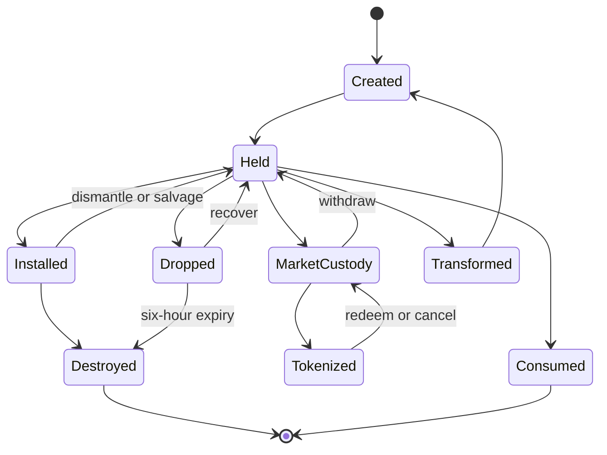

# Asset lifecycle

**Status:** Proposed baseline

## Canonical lifecycle

## Inventory domains

- Character inventory.
- Company inventory.
- Grid/container inventory.
- Installed block inventory.
- Dropped inventory.
- Transfer lock.
- Market custody.
- Blockchain escrow.
- Terminal tombstone.

An asset may occupy exactly one domain.

## Market deposit

1. User requests a deposit.
2. Authoritative inventory validates ownership, quantity, schema, grade, and location.
3. Asset is locked with an operation ID.
4. Market custody accepts the asset.
5. A location-specific receipt is minted or activated.
6. Indexers confirm settlement.
7. AMM or listing eligibility begins.

A timeout retries or reverses safely. Duplicate requests return the original operation result.

## Market withdrawal

1. Receipt holder requests redemption.
2. Contract or reconciler locks/burns the receipt.
3. Confirmation policy is satisfied.
4. Market custody transfers the item to an eligible destination inventory.
5. Withdrawal event records the new owner and location.

If destination capacity is insufficient, the asset remains safely in custody.

## Consumption and transformation

An ordinary in-world item is consumed immediately by the authoritative server and included later in a settlement batch.

A tokenized or escrowed item cannot be consumed in-world. It must first be redeemed into canonical custody.

For transformation of previously tokenized commodities:

1. Redeem receipt.
2. Restore in-world custody.
3. Execute authoritative recipe.
4. Record input consumption and output creation.
5. Include events in a Merkle batch.
6. Tokenize outputs only if the owner deposits them again.

## Death inventory

On death:

- Carried inventory moves into a dropped container at the death coordinate.
- The player respawns without that inventory.
- The container receives a durable six-hour expiration.
- Recovery, transfer, salvage, and final cleanup are explicit events.
- Cleanup is paused during verified universe outages.

The owner/team exclusivity period before public salvage remains unresolved.

## Derelict lifecycle

Proposed timing:

- At loss of qualifying power: timer begins.
- Before 24 hours: owner/company recovery period.
- At 24 hours: public salvage begins.
- At 36 hours: remaining eligible structure is destroyed and cleaned up.

The salvage start is proposed and requires confirmation.

Qualifying insurance/registration suspends ordinary cleanup but not combat damage.

## Grid destruction

Grid destruction may create:

- Surviving blocks.
- Components.
- Cargo drops.
- Salvageable sub-grids.
- Debris with no economic value.
- Voxel changes.
- Destroyed-asset tombstones.

The damage system may aggregate low-value debris, but it must conserve or explicitly sink economic materials.

## Creative assets

Creative/admin assets use a separate namespace and permanent provenance flag.

They cannot:

- Merge into canonical stacks.
- Satisfy contracts.
- Provide AMM liquidity.
- Be salvaged into canonical resources.
- Be exported.
- Become collateral.

An explicit genesis/import governance action is required to create canonical economic assets outside normal gameplay, and that action must be public.

## Private servers

Private-server IDs include a non-canonical namespace and issuer. Official services reject them at every deposit, transfer, contract, and market boundary.
